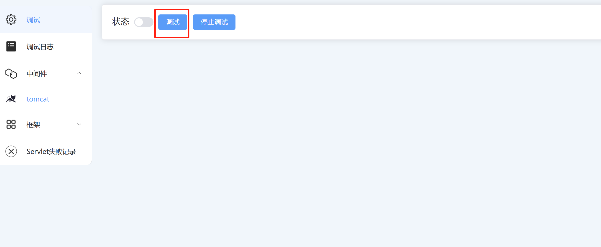

# Router5

## 实时更新的工具：白盒代码审计

    我将工作遇到所有的框架进行了打包，很多时候分析产品的框架比较繁琐，需要分析每一个API的逻辑。但是稍微大一点的产品，逻辑十分复杂，既然本地能下断点，是不是可以利用Java JDI做点什么？

## 究竟能做什么？

 如果是真实的java web项目，这个工具并不能适用以下情况：

1. 在那些无法运行或者仅仅能访问却无法设置添加JDWP的远程调试程序

2. 静态代码

基于此上两个条件：我觉得你已经明白他能跑在什么地方了：

1. 你可以完全运行一个程序

2. 你可以完整地设置程序启动的参数并设置JDWP的调试参数

很显然，这是专门为一些比较大型的产品做分析的工具，因为一般大型的产品架构复杂，光看配置文件都要吐了，更可恶的是，很多情况，一些配置写在文件里，可是真实情况却是在代码中遭到了修改，我觉得这个工具可以做到把这些麻烦的问题解决掉。

## 环境需求

+ Java JDK11
+ 网络端口默认9090

## Tips

+ 5.0做了大量的优化，重启启用了事件调试，经过大量的实验，找到了断点的优化方式
+ 5.0开始不在需要扫描内存，这是如何做到的:
1. 由于有事件调试，现在能过获得对目标内存的修改权限，工具会自动对目标的所有Servlet进行初始化，所以只需要一次内存扫描就能完成所有分析
2. 设置断点必须通过一次请求来触发调试事件，请注意！

## 更新情况

[最新版的更新情况](./UPDATE.md)

## 使用

    你得配置JDWP的IP地址和监听端口

### 设置参数

**地址/端口**：参数为debug调试的数据

### 调试

注意：

1. 现在只有调试按钮，不再存在扫描内存的功能

### 通过浏览器访问目标产品触发调试断点

新的获取方式由于是对目标JDI添加了调试断点，所有需要一个请求触发调试事件！
