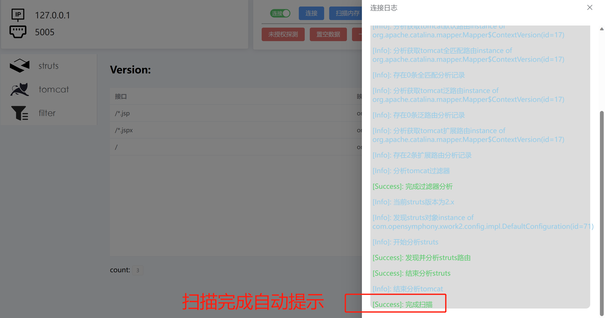

# Router3

## 更新

| Router3更新                                 |
| ----------------------------------------- |
| 去除基于调试事件跟踪定位，直接采用内存分析，不会导致页面产生严重的卡顿       |
| 提高了路由获取的广泛性，能够面对一些修改框架的产品，减少了遗漏路由         |
| 继续支持Spring5/4                             |
| 由于采用内存分析，解决Jetty各种Handle的组合问题             |
| 支持struts2.5/2.4/2.3(2.1环境不知为何，搭建不起)       |
| 采用内存分析不再触发invoke的调试方式，提高了响应速度             |
| 切换为最低JDK11的环境要求，不再需要tools.jar引入，采用JDK模块引入 |

| Router-Router更新情况               |
| ------------------------------- |
| 全面兼容Spring5/4/x                 |
| 全面兼容Jetty的各Handle               |
| 全面兼容Tomcat7/8/9(不再兼容tomcat6)    |
| 新版本已经可以自动检索目标。不再需要手动干预          |
| 更换Spring/Vue架构，不再出现操作系统的UI兼容性问题 |
| 不再阻塞当前堆栈，真正实现无侵入式连接             |
| 不再支持Resin中间件                    |
| 新增功能：自动去除框架或中间的垃圾路由             |

## 使用

### 设置参数

**地址/端口**：参数为debug调试的数据

### 连接分析

### 连接日志

连接分析：连接目标之后，自动跳出调试情况

### 未授权探测

预计未来版本提供对外开放的接口用于项目定制（无法编写全面的类型检测）
