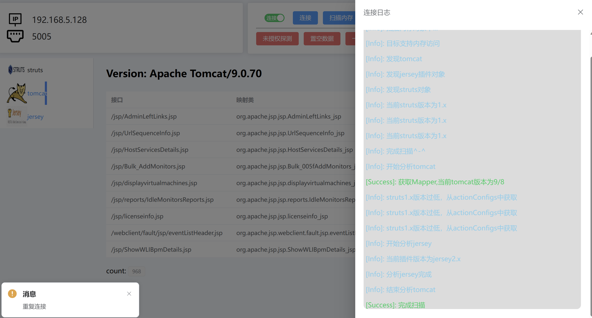

# Router4

## 实时更新的工具：白盒代码审计

    我将工作遇到所有的框架进行了打包，很多时候分析产品的框架比较繁琐，需要分析每一个API的逻辑。但是稍微大一点的产品，逻辑十分复杂，既然本地能下断点，是不是可以利用Java JDI做点什么？

## 究竟能做什么？

 如果是真实的java web项目，这个工具并不能适用以下情况：

1. 在那些无法运行或者仅仅能访问却无法设置添加JDWP的远程调试程序

2. 静态代码

基于此上两个条件：我觉得你已经明白他能跑在什么地方了：

1. 你可以完全运行一个程序

2. 你可以完整地设置程序启动的参数并设置JDWP的调试参数

很显然，这是专门为一些比较大型的产品做分析的工具，因为一般大型的产品架构复杂，光看配置文件都要吐了，更可恶的是，很多情况，一些配置写在文件里，可是真实情况却是在代码中遭到了修改，我觉得这个工具可以做到把这些麻烦的问题解决掉。

## 更新

| Router4更新（第四代：解放双手） |
| ------------------- |
| 把最初的事件断点直接删除，不再等待断点 |
| 在考虑是否引入内存获取字节码反编译功能 |

| Router3更新（第三代：不断完善）                                                            |
| ------------------------------------------------------------------------------ |
| 去除基于调试事件跟踪定位，直接采用内存分析，不会导致页面产生严重的卡顿：<mark>（还是保存最初的事件断点，但是对象的分析不再根据事件分析）</mark> |
| 提高了路由获取的广泛性，能够面对一些修改框架的产品，减少了遗漏路由（内存对象分析，已经不再关心框架每一个修改细节，除非产品把框架对象的字段修改）       |
| 继续支持Spring5/4/3                                                                |
| 全面兼容Struts2的主流版本(2.1以上)，struts1.x                                              |
| 全面兼容jersey1和jersey2                                                            |
| 由于采用内存分析，解决Jetty各种Handle的组合问题                                                  |
| 采用内存分析不再触发invoke的调试方式，提高了响应速度（invoke调试方式需要远程JVM做代码执行）                          |
| 切换为最低JDK11的环境要求，不再需要tools.jar引入，采用JDK模块引入                                      |

| Router-Router更新情况（第二代：补充完善分析的逻辑）                                |
| --------------------------------------------------------------- |
| 全面兼容Spring5/4/3(不兼容3.0.0单一版本)                                   |
| 全面支持Spring三种路由模式：注解路由，简单映射路由，bean名称路由（<mark>第一代只能支持注解解析</mark>） |
| 全面兼容Jetty的各Handle（默认的框架Handle，缺点：<mark>还是无法面对市场的千变万化的修改</mark>） |
| 全面兼容Tomcat7/8/9                                                 |
| 新版本已经可以自动检索目标。不再需要手动干预（只是简单代替用户做HTTP请求，效果不佳）                    |
| 更换Spring/Vue架构，不再出现操作系统的UI兼容性问题（基于B/S）                          |
| 不再阻塞当前堆栈，真正实现无侵入式连接（老版会阻塞程序运行）                                  |
| <mark>不再支持Resin中间件（遇到的比较少，不想挖坑）</mark>                          |
| 新增功能：自动去除框架或中间的垃圾路由                                             |
| 采用JDK8                                                          |

| Router Killer(第一代：定义架构)                        |
| ---------------------------------------------- |
| 兼容Spring5                                      |
| 兼容jetty9（不兼容修改框架的产品）                           |
| 兼容tomcat9/8（不兼容tomcat6/7）                      |
| 兼容Resin(未经过大量产品代码审计的验证)                        |
| 基于Java JDI 断点的事件分析（不适配修改框架的产品）                 |
| 采用JDK8                                         |
| <mark>采用JAVA GUI进行开发（不熟悉API的使用，不兼容Mac）</mark>  |
| <mark>需要用户参与：手动触发某个框架的路由查询断点才能分析（极其不智能）</mark> |
| 无法处理垃圾路由（即一些默认的路由：/error）                      |

## 兼容的版本

| Spring(框架)     | Tomcat(中间件)    | Jersey(我个人觉得是Rest插件)             | Struts(框架) | Jetty(中间件) |
| -------------- | -------------- | -------------------------------- | ---------- | ---------- |
| 9.0.1-9.0.70   | 9.0.1-9.0.70   | 11.0.0                           | 2.5.x      | 2.0-2.39   |
| 8.0.1-8.5.81   | 8.0.1-8.5.81   | 10.0.0-10.0.10                   | 2.3.x      | 1.x        |
| 7.0.30-7.0.103 | 7.0.30-7.0.103 | 9.0.0.v20130308-9.4.50.v20221201 | 2.2.1      |            |

以上是测试的版本，未测试版本不确定能否解析

确定不兼容的组合情况：

    我并不打算支持tomcat6/7解析jersey/struts这样的古老组合，并且我不会支持Spring Mvc + jersey / struts。因为在我遇到的产品，根本没人这么干，jersey/struts更多的还是和中间件一起工作，而不是和spring Mvc。反向jersey/struts更多可能只是和Spring Core一起罢了，但是这在路由和映射类的获取上来说没有任何影响。

## 使用

    你得配置JDWP的IP地址和监听端口

### 设置参数

**地址/端口**：参数为debug调试的数据

### 连接分析

注意：

1. 连接按钮只是简单连接目标的调试监听端口

2. 扫描内存是在连接成功后，工具将自动进行路由扫描

### 连接日志

连接分析：在扫描内存时，会自动打开日志。当看到完成扫描时，说明工具完成了一次<mark>当前内存的扫描</mark>

### 未授权探测

预计未来版本提供对外开放的接口用于项目定制（无法编写全面的类型检测）
