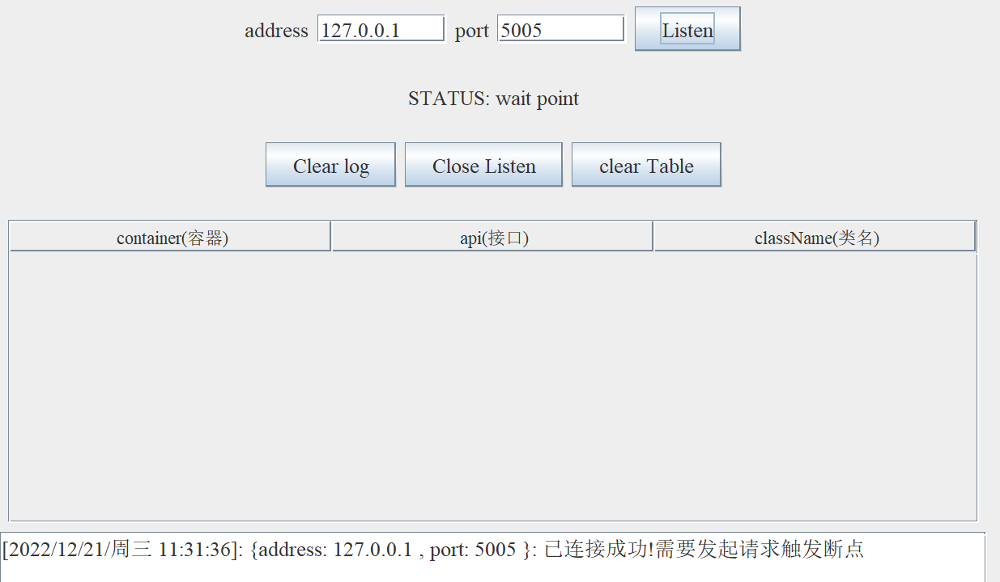
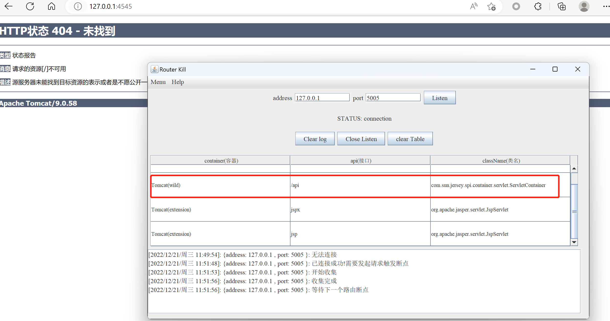
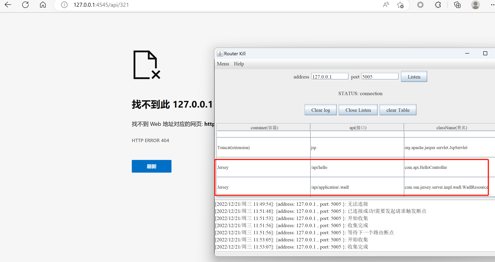

# Router Killer

&emsp;Java项目的路由杀手。每一次IDEA的debug，让我越发觉得工作上的内容太多重复的工作，于是简单了解了Java调试的工作原理，加上一些框架的路由设计，就是产生了一款自动收集项目路由的工具。

## 涉及的技术

+ Java JDI
+ Spring MVC
+ Tomcat
+ Jetty
+ Jersey
+ Resin
+ Struts

## 支持的项目类型

以Java生态为主的项目，后期也打算了解python/go等其他语言在动态的debug之下，如何一键获取路由。

+ Spring MVC/SpringBoot
+ Tomcat + 容器(Spring/Jersey/Struts)
+ Jetty + 容器(Spring/Jersey/Struts)
+ Resin + 容器(Spring/Jersey/Struts)


## 使用说明

### 环境依赖

+ 比较推荐使用JDK8以上的java版本，其中推荐JDK9/JDK11。JDK17有少量版本测试出现异常的现象。
+ 操作系统：windows(不推荐mac，无mac生产工具，但是大部分使用mac的用户反映极差)

### 启动

windows下批处理:

```
run.bat
```

windows命令行启动:

```
"%JAVA_HOME%/bin/javaw"  -Dfile.encoding=UTF-8  -Xbootclasspath/a:"%JAVA_HOME%\lib\tools.jar";.; -jar router-killer.jar
```


### 使用

#### 连接参数

address与port为debug的IP地址与监听端口。

假设在项目中启动了debug的参数如下：

```
-agentlib:jdwp=transport=dt_socket,server=y,suspend=n,address=127.0.0.1:5005
```

则address为：127.0.0.1，port为：5005


#### 状态

STATUS有以下状态:

+ wait connection:等待连接。
+ wait point:表明连接成功，但是在等待断点的触发。
+ connection:表明连接成功
+ try connect:正在连接


#### 连接

当连接成功时，状态会从wait connection转到wait point。此时表示已经debug上项目了。并且日志框回显示以下内容



此时需要发起一个正常的HTTP请求到项目，来触发这个断点，这与平时自己下好断点，然后发请求到指定的路由来触发断点的情况一样。只不过此时这个请求会被工具截过，然后工具自动分析堆栈的情况，然后收集路由信息。

比如存在一个服务http://127.0.0.1:7878，那么直接把地址放在浏览器上即可。（通常推荐先访问根目录获取web中间件的路由）


此时路由信息都已经成功获取了。


### 复杂环境下的路由

可能一些项目是tomcat + jersey等其他组合。

此时搜集的路由方式可能需要变化，首先还是先通过浏览器访问根路径，获取jersey的路由情况。



然后接着访问http://127.0.0.1:4545/api/xxx(/api下任意路由)



此时，整个表格最下面将会出现新的路由信息。


下面列举了一些容器的类名

| 容器   | 类名                                                  |
| ------ | ----------------------------------------------------- |
| Spring | org.springframework.web.servlet.DispatcherServlet     |
| Jersey | com.sun.jersey.spi.container.servlet.ServletContainer |
| struts | org.apache.struts.action.ActionServlet                |


## 容器类型

Tomcat/Jetty/Resin都存在三种类型的路由：

+ 精准路由(exact)
+ 野路由(wild)
+ 扩展路由(extension)

### 精准路由

形如`/api/hello`这类路由，访问接口十分具体


### 野路由

形如`/api/*`这类路由，大多数这类路由都是容器的类，比如Spring/Struts/Jersey。


### 扩展路由


形如`*.do`这类路由，Struts风格的路由就是一个例子

