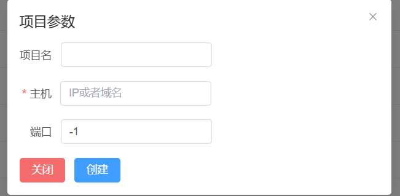

# Router-Router 

## 更新

| 更新情况                                           |
| -------------------------------------------------- |
| 全面兼容Spring5/4/x                                |
| 全面兼容Jetty的各Handle                            |
| 全面兼容Tomcat7/8/9(不再兼容tomcat6)               |
| 新版本已经可以自动检索目标。不再需要手动干预       |
| 更换Spring/Vue架构，不再出现操作系统的UI兼容性问题 |
| 不再阻塞当前堆栈，真正实现无侵入式连接             |
| 不再支持Resin中间件                                |
| 新增功能：自动去除框架或中间的垃圾路由             |

## 使用

### 设置参数

**地址/端口**：参数为debug调试的数据

**目标网站**：此参数用于自动发送请求所用，目标参数可以为任意的路由，但必须是目标服务器提供的路由之一

### 连接分析

目标网站的参数会被内部用于自动分析，已经不再需要自己触发调试条件

### 未授权探测

预计未来版本提供对外开放的接口用于项目定制（无法编写全面的类型检测）
